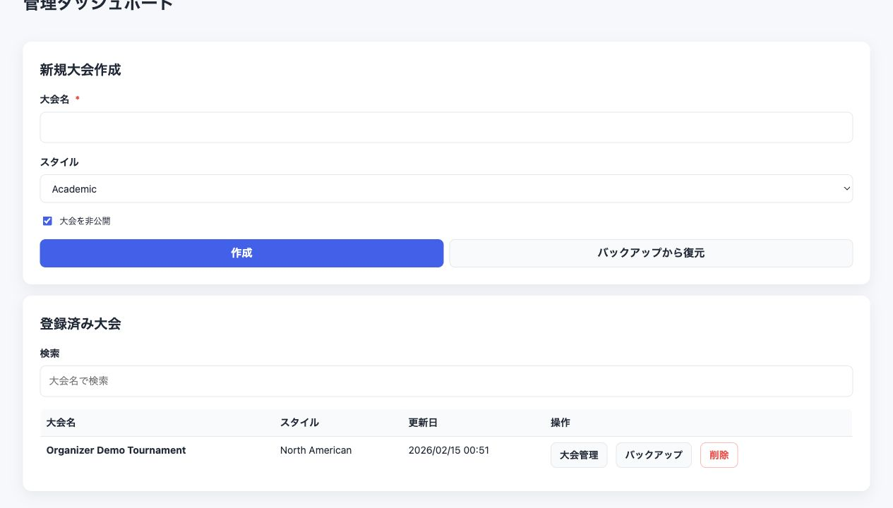
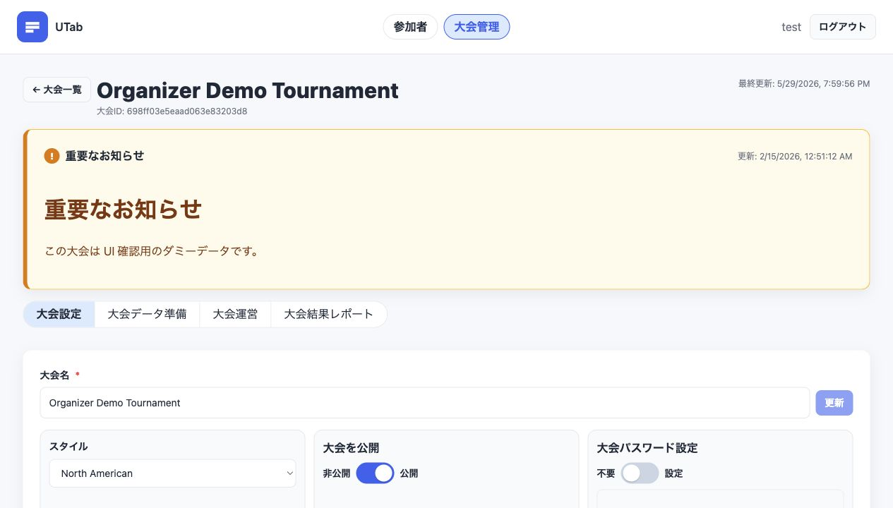
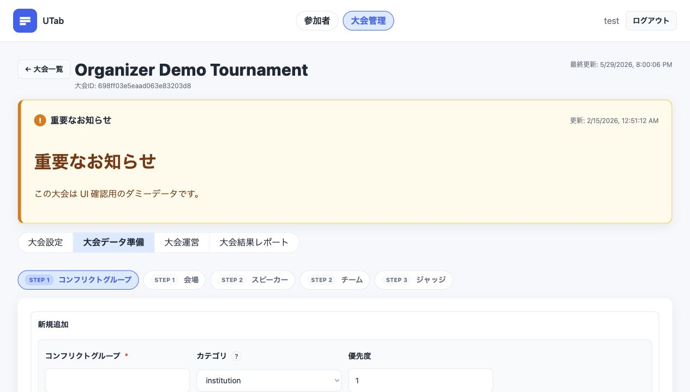
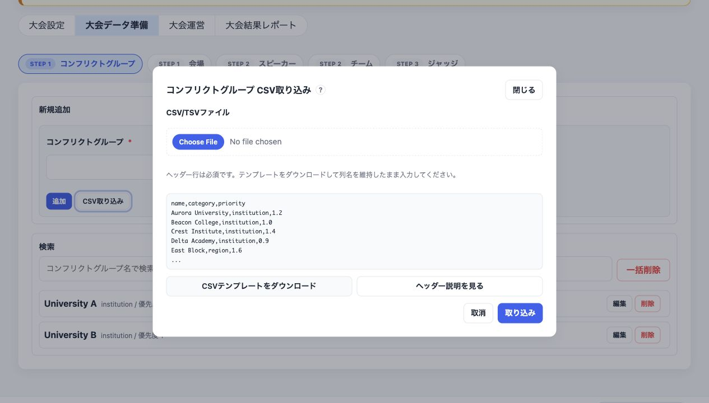
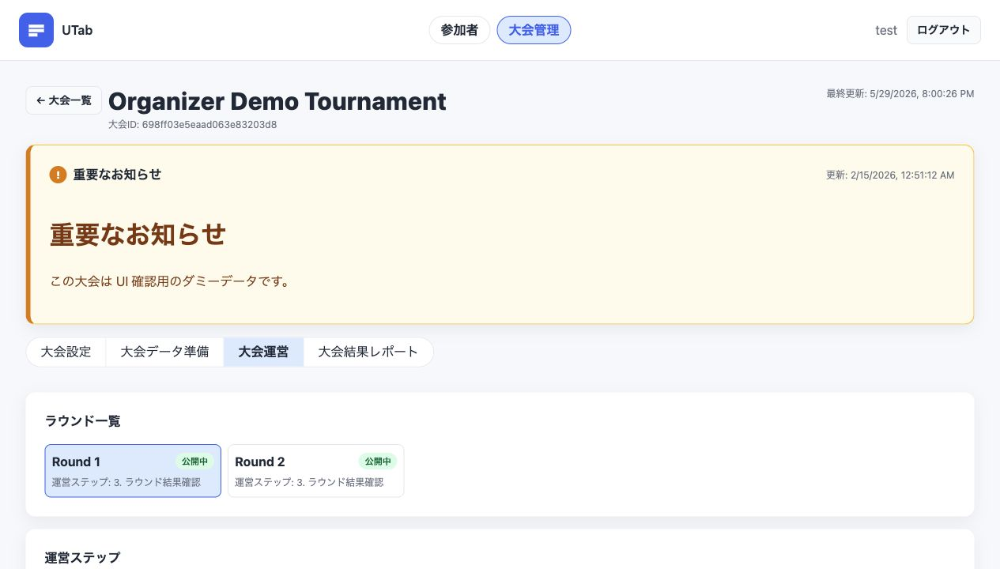
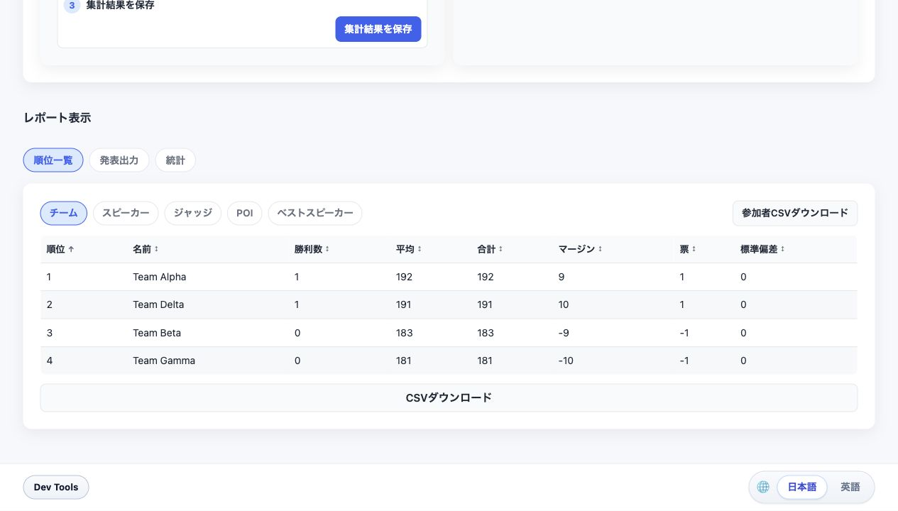
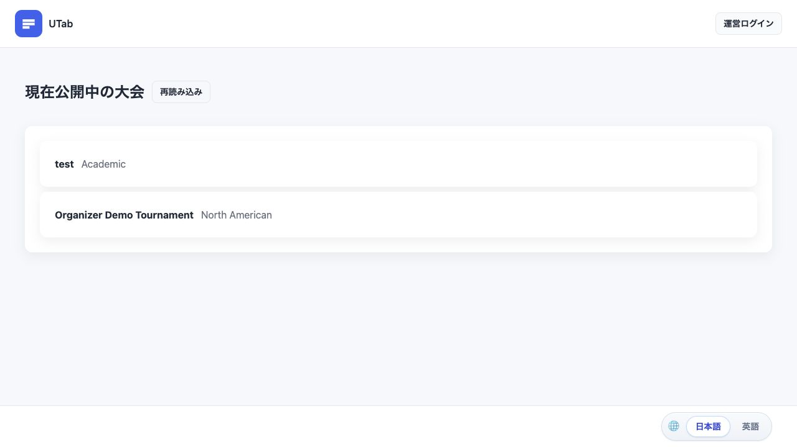
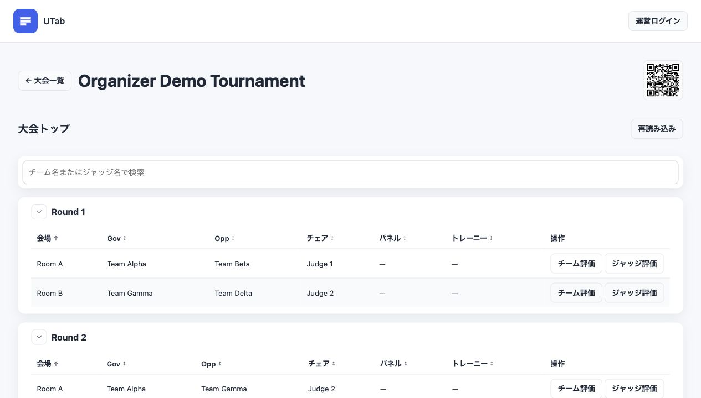
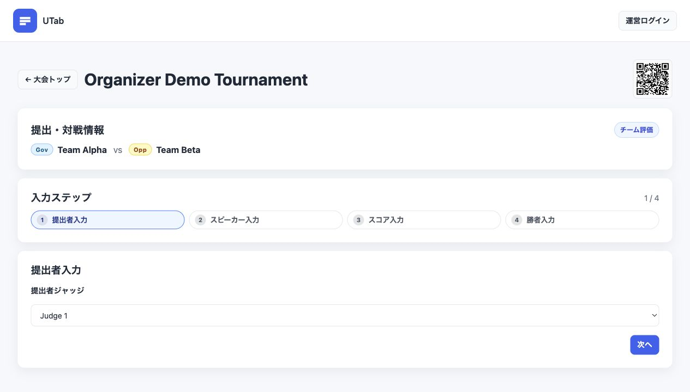
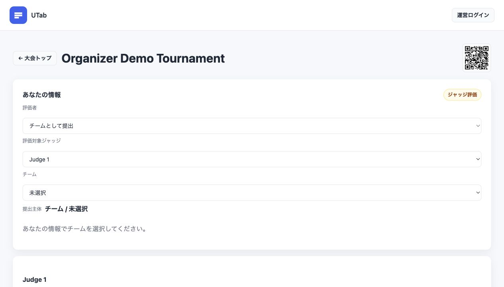

# UTab 利用マニュアル

UTab は、参加者データの管理、対戦表の作成、ラウンド公開、スコア/フィードバック提出、集計、結果発表を扱う大会タブシステムです。運営者は管理画面、参加者は参加者画面を使います。

## 運営者向け

### 1. ログインして大会を開く

1. トップページ右上から運営者アカウントでログインします。
2. 管理ダッシュボードで大会を作成、または既存大会を選択します。
3. 大会を開くと、画面上部に大会内の主要ナビゲーションが表示されます。

大会内の上部ナビは、日常運営では次の順に使います。

| ナビ | 主な用途 |
| --- | --- |
| `大会設定` | 大会名、スタイル、公開状態、参加者パスワード、重要なお知らせ、ラウンド作成を設定します。 |
| `大会データ準備` | コンフリクトグループ、会場、スピーカー、チーム、ジャッジを登録します。 |
| `大会運営` | ラウンドを選び、対戦表作成、公開設定、提出/結果確認を進めます。 |
| `大会結果レポート` | 集計を作成・保存し、順位一覧、発表出力、統計を確認します。 |

### 2. 大会設定

`大会設定` では、大会全体に関わる設定を行います。

- `大会名`: 大会名を変更し、`更新` で保存します。
- `スタイル`: BP、PDA など大会形式に合わせたスタイルを選びます。
- `大会を公開`: 参加者画面の公開大会一覧に出すかを切り替えます。
- `大会パスワード設定`: 参加者が大会に入るときのパスワード要否を設定します。
- `重要なお知らせ`: 参加者画面に表示する案内文を Markdown 形式で入力できます。
- `参加者アクセス用QRコード`: 参加者へ共有する URL と QR コードを確認できます。

ラウンド作成も `大会設定` で行います。ラウンド番号、名称、種別を決めて追加し、必要に応じてブレイク設定や順位優先度設定を調整します。

#### 設定項目の意味

| 項目 | 意味 | 注意点 |
| --- | --- | --- |
| `大会を公開` | 参加者画面 `/user` の公開大会一覧に表示するかを決めます。 | 非公開のままだと、参加者は一覧から大会を見つけられません。 |
| `大会パスワード設定` | 参加者が大会に入る前にパスワード入力を求めるかを決めます。 | パスワードを使う場合は、QRコードやURLと一緒に参加者へ案内します。 |
| `重要なお知らせ` | 参加者画面に出す大会共通の案内です。 | 集合時間、Zoom URL、緊急連絡先などを入れると便利です。 |
| `ブレイク設定` | ブレイク進出数、境界同点、シード方式を決めます。 | ブレイクラウンドを作らない大会では基本的に触りません。 |
| `チーム順位優先度設定` | チーム順位で同点になったときの比較順を決めます。 | 通常は既定のままでよく、特殊ルールがある大会だけ変更します。 |
| `ジャッジ順位優先度設定` | ジャッジ順位で使う指標と優先順を決めます。 | ジャッジ表彰を行う大会で確認します。 |

ブレイク設定の主な項目は次の通りです。

| 項目 | 意味 |
| --- | --- |
| `ブレイクチーム数` | ブレイクへ進出させるチーム数です。 |
| `境界同点の扱い` | カットラインで同点が発生したとき、手動選抜、同点全員通過、人数厳密適用のどれにするかを選びます。 |
| `シード方式` | ブレイク対戦の初期組み合わせを、再シード、固定ブラケット、同順位内ランダム、完全ランダムから選びます。 |

### 3. 大会データ準備

`大会データ準備` は、タブ形式のデータ入力画面です。表示されるタブは次の順で使うと迷いにくくなります。

| タブ | 登録するもの | 使うタイミング |
| --- | --- | --- |
| `コンフリクトグループ` | 所属、地域、リーグなど衝突判定に使うグループ | 最初 |
| `会場` | ラウンドで使う部屋、オンライン部屋、待機枠 | 最初 |
| `スピーカー` | 個人スピーカー | チーム登録の前 |
| `チーム` | チーム名、所属グループ、所属スピーカー | スピーカー登録後 |
| `ジャッジ` | ジャッジ名、事前評価、ジャッジクラス、衝突情報 | 対戦表作成前 |

CSV/TSV 取り込みを使う場合も、まず対象タブを選んでから取り込みます。登録済みデータの検索、編集、削除は各タブ内で行います。

入力順の目安は、`コンフリクトグループ` と `会場`、次に `スピーカー` と `チーム`、最後に `ジャッジ` です。チームやジャッジに紐づく所属情報を先に作っておくと、衝突設定を後から直す手間を減らせます。

#### CSV取り込みの基本

各タブの `CSV取り込み` では、CSV または TSV ファイルを選んで一括登録できます。取り込み画面には `CSVテンプレートをダウンロード` と `ヘッダー説明を見る` があります。初めて使う場合は、テンプレートをダウンロードして列名を変えずに値だけ編集するのが安全です。

共通の注意点は次の通りです。

- 1行目のヘッダー行は必須です。ヘッダーがないファイルは取り込めません。
- 列名は小文字の英数字とアンダースコアを基本にします。テンプレートの列名をそのまま使ってください。
- 複数値は `|` または `;` で区切ります。例: `Aurora University|East Block`
- quoted CSV のセル内では、スピーカー名をカンマ区切りで入れることもできます。例: `"Alice,Bob,Carol,Dave"`
- `true` / `false` は、参加可否や利用可否を表します。`1` / `0`、`yes` / `no` も解釈されます。
- 既存データと同じ名前、またはCSV内の重複名がある場合は警告が出ます。先に重複を確認してください。
- チームCSVで参照するスピーカー、チーム/ジャッジCSVで参照するコンフリクトグループは、先に登録されている必要があります。
- ジャッジCSVの `conflict_teams` や `conflicts_r1` などでチーム名を指定する場合は、先にチームを登録してください。

主なCSV列は次の通りです。

| 対象 | 主な列 | 説明 |
| --- | --- | --- |
| `コンフリクトグループ` | `name`, `category`, `priority` | 所属、地域、リーグなどを登録します。`category` は `institution` / `region` / `league`、`priority` は衝突の重みです。 |
| `会場` | `name`, `priority`, `available`, `available_r1` | 会場名、優先度、全体/ラウンド別の利用可否を登録します。`priority` は小さい値ほど優先利用されます。 |
| `スピーカー` | `name` | スピーカー名だけを登録します。チームCSVより先に取り込むと安全です。 |
| `チーム` | `name`, `institution`, `speakers`, `available`, `available_r1` | チーム名、所属グループ、所属スピーカー、出場可否を登録します。`speakers` は複数名を区切って入力できます。 |
| `ジャッジ` | `name`, `preev`, `judge_class`, `available`, `conflicts`, `conflict_teams`, `available_r1`, `conflicts_r1` | ジャッジ名、事前補正、役割クラス、参加可否、所属/チーム衝突を登録します。 |

`judge_class` は次のいずれかで指定します。

| 値 | 意味 |
| --- | --- |
| `chair_preferred` | Chair を優先して割り当てたいジャッジ |
| `chair_or_panel` | Chair または Panel として使いやすいジャッジ |
| `panel_or_trainee` | 主に Panel / Trainee として使いたいジャッジ |

`available_r1`、`available_r2` のような列は、特定ラウンドだけの可否を上書きします。未指定のラウンドは `available` の値を継承します。

### 4. 大会運営

`大会運営` では、まず `ラウンド一覧` から対象ラウンドを選びます。ラウンドごとに状態チップが表示され、次に行うべきステップが分かります。

運営ステップは左から順に進めます。

| ステップ | 目的 | 主な操作 |
| --- | --- | --- |
| `対戦表作成` | チーム、ジャッジ、会場を割り当てます。 | 自動生成、手動調整、参照集計の選択、配置確認 |
| `ラウンド公開設定` | 参加者に見せる情報を切り替えます。 | モーション公開、チーム割り当て公開、ジャッジ割り当て公開 |
| `ラウンド結果確認` | 提出状況と集計結果を確認します。 | スコアシート/フィードバックの件数確認、提出内容確認、仮集計 |

`対戦表作成` では、自動生成後に警告表示や未配置の項目を確認します。チーム、ジャッジ、会場のいずれかが足りない場合は、`大会データ準備` に戻って追加します。

`ラウンド公開設定` では、公開する情報を分けて管理します。モーションだけ先に公開し、チーム割り当てやジャッジ割り当てを後から公開する運用もできます。

`ラウンド結果確認` では、Ballot と Feedback の提出数を確認します。提出者情報不足や重複提出の警告が出ている場合は、提出データを確認してから集計します。

#### ラウンド詳細設定で確認する項目

各ラウンドには、評価方法や集計方法の上書き設定があります。大会全体の既定値をそのまま使う場合は変更不要ですが、交流大会や合宿などでカテゴリーごとにルールが違う場合は確認してください。

| 設定 | 意味 | 例 |
| --- | --- | --- |
| `評価をジャッジから` | ジャッジからジャッジ評価を受け付けます。 | ジャッジ相互評価を行う大会 |
| `評価をチームから` | チームまたはスピーカーからジャッジ評価を受け付けます。 | 参加者がジャッジ評価を送る大会 |
| `チェアを常に評価` | Chair の評価入力を常に要求します。 | Chair 評価を集計に必ず入れたい場合 |
| `チーム内の評価者` | チーム単位で送るか、スピーカー単位で送るかを決めます。 | 個人ごとにジャッジ評価を出す場合は `スピーカー` |
| `スピーカースコア無し` | スピーカー個別点を入力しない形式にします。 | 勝敗のみ、またはチーム点のみのラウンド |
| `Matter/Manner採点` | スコアを Matter / Manner に分けて入力します。 | PDA形式などで個別入力が必要な場合 |
| `POI賞` | POI賞の入力を有効にします。 | POI表彰がある大会 |
| `Best Speaker賞` | Best Speaker / Best Debater 入力を有効にします。 | 個人表彰がある大会 |
| `引き分け許可` | 引き分け、低勝ち、同点勝ちを許可します。 | ルール上引き分けがあり得る大会 |

集計の `詳細設定` では、次の項目を必要に応じて変更します。

| 設定 | 意味 | 既定の考え方 |
| --- | --- | --- |
| `勝敗判定` | 勝敗入力とスコア大小の整合性をどこまで要求するかを決めます。 | 通常は勝敗入力を優先する設定で運用します。 |
| `引き分け時ポイント` | 引き分け時に各チームへ入る勝敗点です。 | 通常は `0.5` です。 |
| `重複マージ` | 同じ提出者から複数提出がある場合の扱いです。 | 通常は `最新を採用` です。 |
| `欠損データ` | 必要データが足りないとき、警告、除外、エラー停止のどれにするかを選びます。 | 本番集計では不足を見落とさないため `エラー停止` が安全です。 |
| `同一スピーカーPOI処理` | 同一スピーカーへの複数 POI 入力を平均か最大でまとめます。 | 表彰方針に合わせます。 |
| `同一スピーカーBest Debater処理` | 同一スピーカーへの複数 Best 入力を平均か最大でまとめます。 | 表彰方針に合わせます。 |

### 5. 大会結果レポート

`大会結果レポート` では、提出データをもとに集計を作成し、保存済みレポートとして確認します。

画面上部には主に次の領域があります。

- `提出状況`: ラウンドごとの Ballot / Feedback 件数を確認し、必要に応じて `提出状況を確認` から大会運営画面へ戻ります。
- `新規仮集計`: 集計対象ラウンドを選び、`集計` を実行します。必要な場合だけ `詳細設定` で集計条件を変えます。
- `既存レポート`: 保存済みの集計結果を `表示` できます。不要なものは `削除` できます。

集計結果が表示されたら、`レポート表示` のタブで内容を切り替えます。

| 表示 | 内容 |
| --- | --- |
| `順位一覧` | チーム、スピーカー、ジャッジなどカテゴリ別の順位表を確認します。 |
| `発表出力` | 表彰スライド、表彰コピー、受賞者 CSV を準備します。 |
| `統計` | サイド偏り、対戦偏り、ジャッジ担当回数、ジャッジ評価、スコア分布などを確認します。 |

ブレイクラウンドを含む集計では、表示が `予選順位一覧` / `ブレイク順位一覧`、`予選発表出力` / `ブレイク発表出力`、`予選統計` / `ブレイク結果統計` のように分かれます。予選結果とブレイク結果を混ぜずに確認してください。

保存済みレポートは、発表や記録に使う正式なスナップショットとして扱います。新規仮集計は、保存前の確認用です。提出の追加や修正があった場合は、もう一度仮集計を実行し、必要に応じて保存し直します。

## 参加者向け

### 1. 大会に入る

1. `/user` を開きます。
2. `現在公開中の大会` から参加する大会を選びます。
3. 大会パスワードが設定されている場合は、運営者から案内されたパスワードを入力して `入場` します。

運営者から QR コードや URL が共有されている場合は、そのリンクから直接大会トップを開けます。

### 2. 大会トップを見る

大会トップには、公開されているラウンドが表示されます。各ラウンドを開くと、モーション、対戦表、会場、チーム、ジャッジ情報を確認できます。

検索欄では、チーム名またはジャッジ名で絞り込めます。自分のチームや担当ジャッジを探すときに使います。

対戦表には、公開状態に応じて次のような表示が出ます。

- `チーム: 公開`: チーム割り当てが見えます。
- `チーム: 非公開`: チーム割り当てはまだ見えません。
- `ジャッジ: 公開`: ジャッジ割り当てが見えます。
- `ジャッジ: 非公開`: ジャッジ割り当てはまだ見えません。

`ドローは未公開です。` と表示される場合は、運営者がまだ対戦表を公開していません。画面右上の更新ボタンで再読み込みできます。

### 3. チーム評価を送信する

対戦表の `チーム評価` からスコアシート入力画面を開きます。

入力は画面上の `入力ステップ` に沿って進めます。

1. `提出者入力`: 提出者ジャッジを選びます。候補が制限されている場合は、その試合の担当ジャッジだけが表示されます。
2. `スピーカー入力`: 各サイドのスピーカーを順番に選びます。
3. `スコア入力`: スピーカーごとのスコアを入力します。スタイルによっては `マター` / `マナー` に分かれます。
4. `勝者入力`: 勝者、または引き分けを選びます。必要に応じてコメントを入力します。
5. `送信前の確認` で内容を確認し、問題なければ送信します。

送信完了後は、`対戦表に戻る` または `大会トップに戻る` を選びます。

### 4. ジャッジ評価を送信する

対戦表の `ジャッジ評価` からフィードバック入力画面を開きます。

1. `あなたの情報` で評価者を確認します。
2. 評価対象ジャッジを選びます。リンクから開いた場合は、対象があらかじめ選ばれていることがあります。
3. チームまたはスピーカーとして提出する設定の場合は、チームやスピーカーも選びます。
4. スコアを入力します。スタイルによっては `マター` / `マナー` に分かれます。
5. コメントを入力します。
6. `送信` を押し、`送信前の確認` で内容を確認して送信します。

送信完了後は、`対戦表に戻る` または `大会トップに戻る` を選びます。

### 5. 結果送信クイックガイド

ジャッジや参加者へ別紙で案内する場合は、この章だけを抜き出すと使いやすくなります。

#### 送信前に確認すること

- 運営者から案内された大会URLまたはQRコードを開きます。
- 大会パスワードがある場合は、最初に入力します。
- 自分のラウンドを開き、チーム名、会場、担当ジャッジが正しいか確認します。
- 送信前に、自分が `チーム評価` を送るのか、`ジャッジ評価` を送るのかを確認します。

#### チーム評価を送る人

1. 対戦表の自分の試合から `チーム評価` を開きます。
2. 提出者ジャッジを選びます。
3. 両チームのスピーカーを選びます。
4. 各スピーカーのスコアを入力します。
5. 勝者または引き分けを選びます。
6. コメントが必要な場合は入力します。
7. 確認画面で、対戦カード、提出者、勝者、スコアを確認して送信します。

#### ジャッジ評価を送る人

1. 対戦表の自分の試合から `ジャッジ評価` を開きます。
2. 評価対象ジャッジを確認します。
3. 提出主体として、自分のチーム、スピーカー、またはジャッジ名を選びます。
4. スコアとコメントを入力します。
5. 確認画面で、評価対象と提出主体が逆になっていないか確認して送信します。

#### 送信時の注意

- 送信完了画面が出るまでブラウザを閉じないでください。
- 間違えて送った場合は、同じ内容を何度も送り直す前に運営者へ連絡してください。重複提出として検知されることがあります。
- 入力画面で対象ジャッジやチームが見つからない場合は、URLやラウンドが正しいか確認し、それでも出ない場合は運営者へ連絡してください。
- スマートフォンで表が見づらい場合は、検索欄で自分のチーム名やジャッジ名を入れて絞り込んでください。

## FAQ

### どのタブを開けばよいか

| やりたいこと | 開く場所 |
| --- | --- |
| 大会名、公開状態、パスワードを変える | `大会設定` |
| チーム、ジャッジ、会場を登録する | `大会データ準備` |
| ラウンドを作る | `大会設定` |
| 対戦表を作る | `大会運営` → 対象ラウンド → `対戦表作成` |
| 対戦表やモーションを参加者に見せる | `大会運営` → 対象ラウンド → `ラウンド公開設定` |
| 提出状況を見る | `大会運営` → 対象ラウンド → `ラウンド結果確認` |
| 最終順位や発表スライドを作る | `大会結果レポート` |

### 参加者にドローが見えない

次を確認してください。

- 大会が `公開` になっているか。
- 参加者が大会パスワードを入力済みか。
- 対象ラウンドで対戦表が作成済みか。
- `ラウンド公開設定` で `チーム割り当て` または `ジャッジ割り当て` が公開になっているか。
- 参加者が画面を再読み込みしているか。

チームだけ、またはジャッジだけを公開している場合、参加者画面には公開/非公開の状態チップが表示されます。

### 提出が不足している

`大会運営` の `ラウンド結果確認` で、Ballot と Feedback の提出数を確認します。提出者情報不足の警告がある場合は、対象提出を確認し、必要な情報を補完します。

重複提出がある場合、管理画面上部に注意が出ます。不要な提出を削除または修正してから集計してください。

### 保存済みレポートと新規仮集計の違い

`新規仮集計` は、現在の提出データと設定で一時的に集計するための操作です。結果を正式に残すには、集計結果を保存します。

`既存レポート` は、保存済みの集計スナップショットです。発表、CSV 出力、後日の確認には保存済みレポートを使うと、あとから提出データが変わっても当時の結果を参照しやすくなります。

### 集計結果にデータが出ない

次を確認してください。

- 集計対象ラウンドが選択されているか。
- チーム評価やジャッジ評価の提出が必要数そろっているか。
- スピーカースコアなしのラウンドでは、スピーカー別のスコア分析が表示されない場合があります。
- ブレイクラウンドを含む場合、予選表示とブレイク表示を切り替えているか。

## 運営前チェックリスト

- 大会が必要なタイミングで公開されている。
- 大会パスワードを使う場合、参加者へ案内済み。
- 参加者向けURLまたはQRコードをスタッフが確認済み。
- コンフリクトグループ、会場、スピーカー、チーム、ジャッジが登録済み。
- CSV取り込み後、未登録名、重複名、ラウンド別参加可否を確認済み。
- ラウンドが作成済み。
- ラウンド詳細設定で、評価者、Matter/Manner、POI/Best、引き分け許可を確認済み。
- 対戦表作成前に、参加チーム数、会場数、ジャッジ数を確認済み。
- ラウンド公開前に、チーム割り当てとジャッジ割り当ての公開範囲を確認済み。
- ジャッジ/参加者に結果送信手順を案内済み。
- 集計前に、Ballot と Feedback の不足や重複を確認済み。
- 発表前に、保存済みレポート、順位一覧、発表出力、統計を確認済み。
